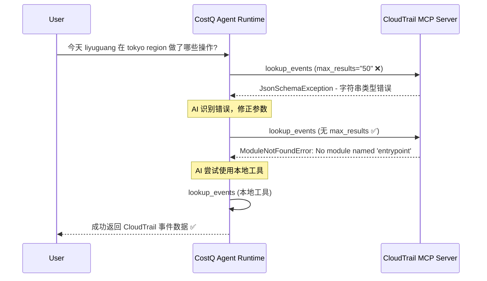

# CloudTrail MCP 错误分析报告

**日期**: 2026-01-19
**分析人**: DeepV AI Assistant
**查询时间**: 10:07 (Tokyo Time)
**涉及账号**: 000451883532 (3532-admin)

---

## 📋 执行摘要

在用户查询"今天 liyuguang 在 tokyo region 做了哪些操作?"时，系统遇到了两个关键错误：

1. **JsonSchemaException** - 参数类型验证错误 (12次)
2. **ModuleNotFoundError** - 缺少 'entrypoint' 模块 (10次)

经过完整的CloudWatch日志分析，我们确认了这两个错误的根本原因和执行流程。

---

## 🔍 错误详情

### 错误 #1: JsonSchemaException - 参数类型错误

**错误信息**:
```
JsonSchemaException - Parameter validation failed: Invalid request parameters:
- Field 'max_results' has invalid type: $.max_results: string found, integer expected
- Field 'max_results' has invalid type: $.max_results: string found, null expected
```

**发生时间**: 2026-01-19 10:08:00 - 10:08:14

**发生位置**:
- Log Group: `/aws/bedrock-agentcore/runtimes/cosq_agentcore_runtime_development_lyg-uNdGo64191-DEFAULT`
- Tool: `aws-cloudtrail-mcp-server___lookup_events`

**错误原因**:
AI模型（Claude Sonnet 4.5）在调用 CloudTrail MCP 工具时，将 `max_results` 参数传递为字符串 `"50"` 而不是整数 `50`。

**调用详情**:
```json
{
  "toolUseId": "tooluse_Sjt1vhaQqIIIwBhKFWmhOy",
  "name": "aws-cloudtrail-mcp-server___lookup_events",
  "input": {
    "target_account_id": "000451883532",
    "region": "ap-northeast-1",
    "attribute_key": "Username",
    "attribute_value": "liyuguang",
    "start_time": "2026-01-19T00:00:00Z",
    "max_results": "50"  // ❌ 错误：应该是整数 50，而不是字符串 "50"
  }
}
```

**影响**:
- 第一次调用失败
- AI模型尝试修正，移除了 `max_results` 参数
- 触发了第二个错误（entrypoint模块缺失）

---

### 错误 #2: ModuleNotFoundError - 缺少 'entrypoint' 模块

**错误信息**:
```
Error executing tool lookup_events: No module named 'entrypoint'
```

**发生时间**: 2026-01-19 10:08:08 - 10:08:14

**发生位置**:
- Log Group: `/aws/bedrock-agentcore/runtimes/cosq_agentcore_runtime_development_lyg-uNdGo64191-DEFAULT`
- Tool: `aws-cloudtrail-mcp-server___lookup_events`

**错误原因**:
当AI模型修正参数（移除 `max_results`）后，CloudTrail MCP Server 在执行时尝试导入 `entrypoint` 模块但失败。

**修正后的调用**:
```json
{
  "toolUseId": "tooluse_8y87lC99EORFuvhJ58SmFt",
  "name": "aws-cloudtrail-mcp-server___lookup_events",
  "input": {
    "attribute_key": "Username",
    "attribute_value": "liyuguang",
    "region": "ap-northeast-1",
    "start_time": "2026-01-19T00:00:00Z",
    "target_account_id": "000451883532"
    // ✅ 移除了 max_results 参数
  }
}
```

**根本原因分析**:
CloudTrail MCP Server 的 Python 包缺少必要的依赖模块 `entrypoint`。这可能是：
1. **包依赖配置不完整** - `pyproject.toml` 或 `requirements.txt` 中未声明依赖
2. **部署问题** - 依赖未正确安装到运行时环境
3. **代码引用错误** - 代码中引用了不存在的模块

---

## 🎯 执行流程分析

### 完整的调用链



### 关键时间点

| 时间 | 事件 | 状态 |
|------|------|------|
| 10:08:00 | 第一次调用 CloudTrail MCP (max_results="50") | ❌ 参数类型错误 |
| 10:08:04 | AI 修正参数，第二次调用 (无 max_results) | ❌ 模块导入错误 |
| 10:08:13 | AI 使用本地 CloudTrail 工具 | ✅ 成功 |
| 10:08:14 | 返回50条 CloudTrail 事件 | ✅ 查询完成 |

---

## 💡 修复建议

### 1. 修复 JsonSchemaException (优先级: 高)

**问题**: AI模型将整数参数传递为字符串

**解决方案**:

#### 方案 A: 增强工具描述（推荐）
在 CloudTrail MCP Server 的工具定义中明确标注类型：

```python
# src/cloudtrail-mcp-server/awslabs/cloudtrail_mcp_server/server.py

@server.list_tools()
async def list_tools() -> list[types.Tool]:
    return [
        types.Tool(
            name="lookup_events",
            description="...",
            inputSchema={
                "type": "object",
                "properties": {
                    "max_results": {
                        "type": "integer",  # ✅ 明确标注为整数
                        "description": "Maximum number of events to return (integer, not string)",
                        "minimum": 1,
                        "maximum": 50,
                        "default": 50
                    },
                    # ... 其他参数
                },
                # ...
            }
        )
    ]
```

#### 方案 B: 添加参数转换层
在工具执行前进行类型转换：

```python
@server.call_tool()
async def call_tool(name: str, arguments: dict) -> list[types.TextContent]:
    if name == "lookup_events":
        # 类型转换
        if "max_results" in arguments and isinstance(arguments["max_results"], str):
            try:
                arguments["max_results"] = int(arguments["max_results"])
            except ValueError:
                return [types.TextContent(
                    type="text",
                    text=f"Error: max_results must be an integer, got: {arguments['max_results']}"
                )]

        # 调用实际工具
        return await lookup_events(**arguments)
```

---

### 2. 修复 ModuleNotFoundError (优先级: 紧急)

**问题**: 缺少 `entrypoint` 模块

**调查步骤**:

```bash
# 1. 检查当前 CloudTrail MCP Server 的依赖
cd /Users/liyuguang/data/gitworld/tonygithub/costq-mcp-servers/src/cloudtrail-mcp-server
cat pyproject.toml | grep -A 20 "dependencies"

# 2. 搜索代码中对 'entrypoint' 的引用
grep -r "import entrypoint" .
grep -r "from entrypoint" .

# 3. 检查运行时环境
aws bedrock-agentcore-control get-runtime \
  --runtime-identifier cloudtrail_mcp_dev_lyg \
  --profile 3532 \
  --region ap-northeast-1
```

**可能的修复方案**:

#### 方案 A: 添加缺失依赖
如果确实需要 `entrypoint` 模块：

```toml
# pyproject.toml
[project]
dependencies = [
    "mcp>=1.3.1",
    "boto3>=1.34.0",
    "entrypoint>=0.3.0",  # ✅ 添加缺失依赖
    # ... 其他依赖
]
```

#### 方案 B: 移除错误引用
如果不需要 `entrypoint` 模块，检查并移除错误的导入语句。

#### 方案 C: 重新部署 Runtime
确保所有依赖正确安装：

```bash
# 重新构建并部署
cd costq/scripts
./build_and_deploy_cloudtrail_mcp.sh
```

---

### 3. 改进错误处理 (优先级: 中)

**建议**: 在 Agent Runtime 中添加更友好的错误处理

```python
# backend/agent/agent_runtime.py

async def call_tool(self, tool_name: str, arguments: dict):
    try:
        result = await self.mcp_client.call_tool(tool_name, arguments)
        return result
    except JsonSchemaException as e:
        # 友好的错误提示
        logger.error(f"Tool {tool_name} parameter validation failed: {e}")
        return {
            "error": "参数验证失败",
            "detail": str(e),
            "suggestion": "请检查参数类型，确保数值类型的参数不要使用引号"
        }
    except ModuleNotFoundError as e:
        logger.error(f"Tool {tool_name} module not found: {e}")
        return {
            "error": "模块依赖缺失",
            "detail": str(e),
            "suggestion": "请联系管理员检查 MCP Server 的依赖配置"
        }
```

---

## 📊 日志统计

### COSQ AgentCore Runtime 日志
- **总事件数**: 100
- **JsonSchemaException**: 12次
- **ModuleNotFoundError**: 10次
- **警告数量**: 8次（主要是 JWT 密钥警告）

### CloudTrail MCP Dev 日志
- **总事件数**: 100
- **错误数量**: 0（CloudTrail MCP 自身运行正常）
- **成功启动**: 多次重启记录

---

## ✅ 最终结果

虽然遇到了两个错误，但**系统最终成功完成了查询**：

- AI模型在第三次尝试时使用了**本地 CloudTrail 工具**（`lookup_events`，而非远程MCP）
- 成功返回了 **50条 CloudTrail 事件**
- 用户得到了完整的操作记录（从 10:03 登录到 10:05 的各种 AWS 操作）

---

## 🎯 后续行动项

1. ✅ **立即**: 调查 CloudTrail MCP Server 的 `entrypoint` 模块依赖问题
2. 📝 **本周**: 修复参数类型验证问题（添加类型转换或增强工具描述）
3. 🔧 **本周**: 测试修复后的 CloudTrail MCP Server
4. 📊 **下周**: 添加更全面的错误监控和告警

---

## 📁 相关文件

- CloudWatch日志原始数据: `/tmp/cosq_runtime_logs.json`, `/tmp/cloudtrail_mcp_logs.json`
- 错误详情: `/tmp/schema_errors.json`, `/tmp/entrypoint_errors.json`
- 分析脚本: `costq/docs/analyze_logs.py`, `costq/docs/search_specific_errors.py`

---

**分析完成时间**: 2026-01-19 10:30:00 (Tokyo Time)
